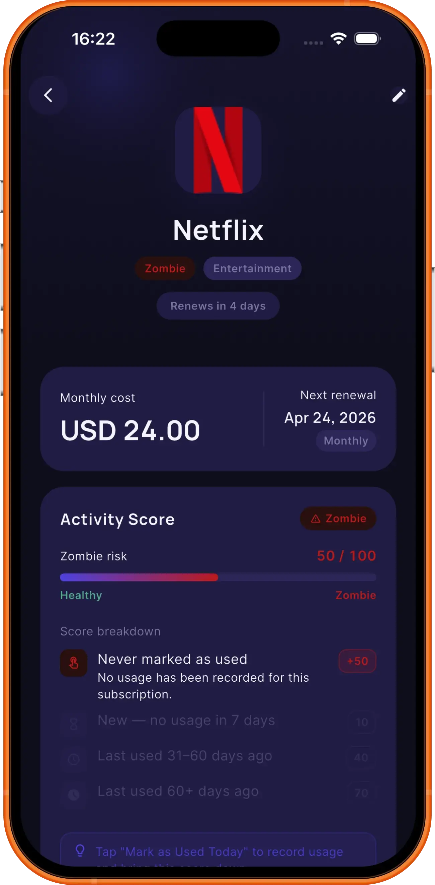
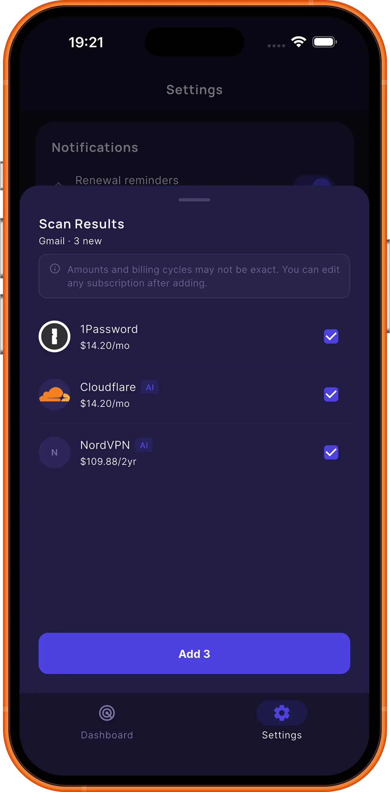

# SEO İyileştirme Planı — centryai.app
Kaynak: HubSpot SEO Audit — 2026-06-09 (42 öneri) + 2026-06-10 (39 öneri) + 2026-06-10-1 (yeni audit)

---

## 🔴 Öncelik 1 — YÜKSEK ETKİ (Performans)

### ✅ 1. Görselleri WebP'ye dönüştür ve sıkıştır
**Etki:** LCP 16,506ms → hedef <2,500ms
**Zorluk:** Orta

Optimize edilecek dosyalar (`uploads/`):
| Dosya | Mevcut | Tasarruf |
|-------|--------|---------|
| phone-light-netflix.png | 976KB | ~898KB |
| phone-dark-dashboard.png | 937KB | ~839KB |
| phone-dark-netflix.png | ~940KB | ~860KB |
| phone-dark-aicancelfinder.png | 612KB | ~550KB |
| phone-dark-googlesearch.png | 608KB | ~545KB |
| phone-dark-list.png | 537KB | ~480KB |
| phone-dark-calendar.png | 531KB | ~478KB |
| phone-dark-aiscanner.png | 416KB | ~374KB |

**Yapılacak:**
- `cwebp` veya `squoosh-cli` ile tüm PNG'leri WebP'ye çevir
- HTML'deki `` → `<picture>` + WebP + PNG fallback
- Ya da direkt `.webp` kullan (tüm modern browserlar destekliyor)

**Komut (toplu dönüşüm):**
```bash
cd website/uploads
for f in *.png; do cwebp -q 80 "$f" -o "${f%.png}.webp"; done
```

---

### ✅ 2. main.mp4 sıkıştır
**Etki:** Ana sayfa ağ yükü azaldı
**Tamamlandı:** 2026-06-09

`assets/main-original.mp4` (11MB) → `assets/main.mp4` (1.0MB, ffmpeg libx265 ile). `preload="none"` zaten vardı.

---

### ✅ 3a. React production builds — index.html, support.html, feedback.html
**Etki:** ~1.35MB blocking JS → ~180KB (~7x küçülme); LCP için ana bottleneck giderildi
**Tamamlandı:** 2026-06-10

`react.development.js` + `react-dom.development.js` → `react.production.min.js` + `react-dom.production.min.js` (3 sayfada).

### ✅ 3b. LCP preload + fetchPriority
**Etki:** Browser LCP görselini JS'den önce fetch ediyor
**Tamamlandı:** 2026-06-10

- `<link rel="preload" as="image" href="uploads/phone-dark-netflix.webp" fetchpriority="high"/>` `<head>`'e eklendi
- LCP img'e `fetchPriority="high"` eklendi
- Hero yan görsel + service icon'lara `loading="lazy"` eklendi

### ✅ 3c. babel.min.js CDN'den kaldır (support + feedback)
**Etki:** support.html + feedback.html'den Babel CDN kaldırıldı
**Tamamlandı:** 2026-06-10

`support.html`, `feedback.html` → JSX, `@babel/core` + `@babel/preset-react` ile önceden derlendi; Babel CDN kaldırıldı.

**index.html — geri alındı:** `index.html` birden fazla `<script type="text/babel">` bloğu içerdiğinden derleme bozuk çıktı (2053 → 4432 satır). Reverted, Babel CDN korunuyor. Kalıcı çözüm için Vite/esbuild build pipeline gerekiyor.

---

## 🟡 Öncelik 2 — ORTA ETKİ (Crawling & SEO)

### ✅ 4. Ghost URL'leri 404'e düşür (8 boş sayfa)
**Etki:** Google crawl bütçesi korunur, index kirliliği önlenir
**Zorluk:** Düşük

Google'ın içeriksiz saydığı URL'ler:
```
/support/feedback
/terms/privacy
/privacy/support
/privacy/terms
/support/terms
/privacy/privacy
/support/privacy
/terms/terms
```
Bu URL'ler SPA router'ın ürettiği anlamsız kombinasyonlar.

**Çözüm — `netlify.toml`'a redirect ekle:**
```toml
[[redirects]]
  from = "/support/feedback"
  to = "/404"
  status = 404

[[redirects]]
  from = "/terms/privacy"
  to = "/404"
  status = 404

[[redirects]]
  from = "/privacy/support"
  to = "/404"
  status = 404

[[redirects]]
  from = "/privacy/terms"
  to = "/404"
  status = 404

[[redirects]]
  from = "/support/terms"
  to = "/404"
  status = 404

[[redirects]]
  from = "/privacy/privacy"
  to = "/404"
  status = 404

[[redirects]]
  from = "/support/privacy"
  to = "/404"
  status = 404

[[redirects]]
  from = "/terms/terms"
  to = "/404"
  status = 404
```

---

### ✅ 5. Eksik alt text ekle
**Etki:** On-page SEO + erişilebilirlik
**Zorluk:** Düşük

`index.html` → `phone-light-netflix.png` img tag'inde `alt=""` boş.

**Düzeltme:** `alt="CentryAI app — Netflix subscription light mode"` ekle

---

### ✅/❌ 6. /terms ve /privacy meta description ekle
**Etki:** Arama sonuçlarında snippet görünümü
**Zorluk:** Düşük

`terms.html` ve `privacy.html` head bölümüne ekle:

```html
<!-- terms.html -->
<meta name="description" content="CentryAI Terms of Use — read our terms of service for the CentryAI subscription tracker app.">

<!-- privacy.html -->
<meta name="description" content="CentryAI Privacy Policy — how we handle your data in the CentryAI subscription tracking app.">
```

---

## 🟢 Öncelik 3 — DÜŞÜK ETKİ (Metin düzeltmeleri)

### ✅ 7. Meta description uzunluklarını kısalt (max 155 karakter)
**Tamamlandı:** 2026-06-10 — HubSpot 2026-06-10 audit (39 öneri)

| Sayfa | Mevcut uzunluk | Hedef |
|-------|---------------|-------|
| /rocket-money-alternative | 189 karakter | ≤155 |
| /zombie-subscriptions | 183 karakter | ≤155 |
| /tr/en-iyi-abonelik-takip-uygulamasi | 167 karakter | ≤155 |
| /how-to-cancel-subscriptions | uzun | ≤155 |
| /best-subscription-tracker | uzun | ≤155 |

---

### ✅ 8. Title uzunluklarını kısalt (max 70 karakter)
**Tamamlandı:** 2026-06-10

| Sayfa | Eski | Yeni |
|-------|------|------|
| /bobby-alternative | 72 chr → "Best Bobby App Alternatives in 2026 — With Automatic Detection & Android" | "Best Bobby App Alternatives in 2026 — Auto-Detect & Android" (60 chr) |
| /how-to-find-subscriptions-without-bank-linking | 72 chr | "How to Find All Your Subscriptions Without Linking Your Bank (2026)" (67 chr) |

---

### ✅ 9. Mobil tap target büyüt
**Sayfa:** `/support`
**Tamamlandı:** 2026-06-10

`mailto:support@centryai.app` + `feedback` linkleri → `display: inline-block; padding: 12px 0; min-height: 44px`

---

---

## 🔴 2026-06-10-1 Audit — YENİ BULGULAR

### 10. ❌ index.html LCP — logo SVG 8399ms (kritik)
**Etki:** LCP 8399ms — Google skor etkisi çok yüksek
**Zorluk:** Orta
**Kaynak:** SPEED_UP_LARGEST_CONTENTFUL_PAINT

Sorun: `` nav içindeki logo, ana sayfa LCP öğesi olarak algılanıyor. Preload eklenen `phone-dark-netflix.webp` hâlâ yeterince hızlı render edilemiyor.

**Yapılacak:**
```html
<!-- index.html <head> içine ekle -->
<link rel="preload" as="image" href="logo2.svg" fetchpriority="high">
```
Alternatif: Logo'yu `` yerine inline SVG olarak göm → bant genişliği tüketimi sıfır.

**Diğer etkilenen sayfalar (SPEED_UP_LCP):**
| Sayfa | LCP | LCP Öğesi |
|-------|-----|-----------|
| `/` | 8399ms | logo2.svg img |
| `/support` | 3240ms | `<h1>` |
| `/feedback` | 2754ms | `<h1>` |
| `/privacy` | 3046ms | `<p>` |
| `/terms` | 2733ms | logo2.svg img |
| `/es/mejor-app-suscripciones` | 2955ms | `<p>` |

Çözüm: Her sayfada nav logo için `<link rel="preload" as="image" href="logo2.svg">` + `fetchpriority="high"` ekle.

---

### 11. ❌ Görsel boyutlandırma — 9 görsel, 561KB fazla yük
**Etki:** Performans — sayfa ağırlığı
**Zorluk:** Orta
**Kaynak:** USE_CORRECTLY_SIZED_IMAGES (index.html)

HubSpot 9 görselde srcset veya boyut uyumsuzluğu tespit etti (toplam 561KB tasarruf potansiyeli).
Etkilenen görseller (WebP'e çevrildi ama display boyutuna göre sıkıştırılmadı):
- `phone-dark-dashboard.webp` — büyük
- `phone-dark-list.webp`
- `phone-dark-calendar.webp`
- `phone-dark-aicancelfinder.webp`
- `phone-dark-googlesearch.webp`
- `phone-dark-aiscanner.webp`
- Diğerleri

**Yapılacak:** `` tag'lerine `width` + `height` attribute ekle; `srcset` ile responsive versiyonlar sun.
```html

```

---

### 12. ✅ Offscreen görsel erteleme — phone-dark-aiscanner.webp
**Etki:** 55KB gereksiz initial yük
**Zorluk:** Düşük
**Kaynak:** DEFER_LOADING_OFFSCREEN_IMAGES (index.html)

`phone-dark-aiscanner.webp` ekrana ilk yüklemede görünmüyor ama eager load ediliyor.

**Yapılacak:** `loading="lazy"` ekle:
```html

```

---

### 13. ✅ /support ve /feedback meta description eksik
**Etki:** Arama snippet'i görünmüyor
**Zorluk:** Düşük
**Kaynak:** ADD_META_DESCRIPTION

```html
<!-- support.html <head> -->
<meta name="description" content="Contact CentryAI support. Get help with subscription tracking, email scanning, or account issues. We respond within 24 hours.">

<!-- feedback.html <head> -->
<meta name="description" content="Send feedback to the CentryAI team. Help us improve your subscription tracking experience with your suggestions and ideas.">
```

---

### 14. ✅ 6 yeni sayfada meta description çok uzun (>155 chr)
**Tamamlandı:** 2026-06-10
**Etki:** Google meta'yı kesiyor, AEO snippet kayıpları
**Zorluk:** Düşük
**Kaynak:** SHORTEN_META_DESCRIPTION

| Sayfa | Mevcut (chr) | Kısaltılmış versiyon |
|-------|-------------|----------------------|
| `/copilot-alternative` | 165 | "Looking for a Copilot Money alternative? CentryAI works internationally, requires no bank account, and auto-detects subscriptions. Free to start." (147 chr) |
| `/subtrack-alternative` | 167 | "Looking for a Subtrack alternative? CentryAI auto-detects subscriptions from your inbox, scores zombie subs, and finds cancel pages in one tap. Free." (152 chr) |
| `/free-subscription-tracker` | 162 | "The best free subscription tracker apps compared: what you get for free and when upgrading is worth it. CentryAI free plan includes AI scanning." (146 chr) |
| `/es/cancelar-suscripciones` | 178 | "Guía completa para cancelar cualquier suscripción: Netflix, Spotify, gimnasio y más. Usa el Cancel Finder de CentryAI para encontrar la página exacta." (153 chr) |
| `/es/mejor-app-suscripciones` | 162 | "Comparativa: CentryAI, Bobby, Rocket Money y Subtrack. La mejor app para rastrear suscripciones en 2026 según detección, privacidad y precio." (143 chr) |
| `/tr/abonelik-iptali` | 160 | "Herhangi bir aboneliği iptal etme rehberi: Netflix, Spotify, spor salonu ve daha fazlası. Tek dokunuşla iptal sayfasını bulmak için CentryAI." (143 chr) |

---

### 15. ⚠️ Ghost URL'ler hâlâ tespit ediliyor (netlify.toml doğrulama)
**Kaynak:** REMOVE_BLANK_PAGES — 8 sayfa (aynı #4 maddesindekiler)

`netlify.toml`'a redirect eklendi (bkz. #4) ama HubSpot hâlâ bu URL'leri buluyor. Olası nedenler:
- Deploy henüz yayınlanmadı
- Crawler'ın cache'i güncellenmedi

**Aksiyon:** Deploy durumunu doğrula; `netlify status` çalıştır.

---

### 16. ⚠️ REDUCE_TOTAL_BLOCKING_TIME — index.html, feedback.html, support.html
**Etki:** Babel CDN (index.html) + diğer blocking scriptler
**Kaynak:** REDUCE_TOTAL_BLOCKING_TIME

index.html'de Babel CDN hâlâ mevcut (bkz. #3c ⚠️). Kalıcı çözüm: Vite build pipeline.

---

---

## 🔴 2026-06-19/20 HubSpot Performance Audit — TAMAMLANDI

**Kaynak:** HubSpot Breeze AI — 7 CSV analizi (2026-06-19 akşamı)
**Sonuç:** LCP flagged sayfa 38 → 9–12 bandı (%70+ azalma), TBT 613ms → rezole, CLS rezole.

### ✅ 19. CSS @import Waterfall Kaldır
**Etki:** Google Fonts render-blocking 2-hop zinciri giderildi
**Tamamlandı:** 2026-06-19

`shared.css` içindeki `@import url('https://fonts.googleapis.com/...')` kaldırıldı.
Tüm 41 HTML sayfasına doğrudan `<link rel="stylesheet">` eklendi → paralel yükleme.

### ✅ 20. Google Fonts Async Preload
**Etki:** Google Fonts CSS render-blocking olmaktan çıktı
**Tamamlandı:** 2026-06-19

```html
<!-- Eski (render-blocking) -->
<link rel="stylesheet" href="https://fonts.googleapis.com/css2?...&display=swap"/>

<!-- Yeni (async) -->
<link rel="preload" href="https://fonts.googleapis.com/css2?...&display=optional" as="style" onload="this.onload=null;this.rel='stylesheet'"/>
<noscript><link rel="stylesheet" href="..."/></noscript>
```
41 sayfada uygulandı. `display=swap` → `display=optional` (CLS önlemi).

### ✅ 21. shared.css Async + Inline Critical CSS
**Etki:** Sıfır render-blocking CSS — tarayıcı critical CSS ile anında render eder
**Tamamlandı:** 2026-06-20

```html
<!-- Inline critical CSS (~20 rule) -->
<style>:root{--bg:#07090f;--fg:#eceef4;...}body{background:var(--bg);color:var(--fg);...}</style>

<!-- shared.css async -->
<link rel="preload" href="shared.css?v=7" as="style" onload="this.onload=null;this.rel='stylesheet'"/>
<noscript><link rel="stylesheet" href="shared.css?v=7"/></noscript>
```
41 sayfada uygulandı. Critical CSS beyaz flash'ı önler; shared.css arka planda yüklenir.

### ✅ 22. @xs Görsel Tier + srcSet sizes
**Etki:** 2x DPR ekranlarda phone görsel yükü 57KB → 12KB (%79 azalma)
**Tamamlandı:** 2026-06-20

10 adet `@xs` görsel üretildi (325×660px, Q72, 8–14KB).
`app.js`'deki tüm 12 `srcSet`'e `@xs` eklendi + `sizes="(max-width:480px) 220px, 260px"` inject edildi.
`index.html` preload → `imagesrcset` ile akıllı preload.

### ✅ 23. CLS Fix — display=optional
**Etki:** apple-one ve mejor-app-suscripciones CLS 0.10/0.11 → 0
**Tamamlandı:** 2026-06-20

Font swap kaynaklı layout shift. `display=swap` → `display=optional` ile font yalnızca cache'deyse swap eder.

### ✅ 24–28. Diğer Küçük Düzeltmeler
- **preconnect** → `fonts.googleapis.com` + `fonts.gstatic.com` index.html dahil tüm sayfalara eklendi
- **Meta desc** → nordvpn (160→133), apple-one (172→136), duolingo (168→138), adobe (172→149)
- **H1 crawler** → support.html + feedback.html static `<div id="root">` içeriği eklendi
- **Ghost URL** → privacy.html + terms.html footer/nav relative → absolute (`/privacy`, `/terms`, `/support`)
- **Viewport** → youtube-premium.html `overflow-x: hidden` + `.step-text` word-break

---

### 📊 HubSpot Scan Seyri (2026-06-19 akşamı)

| Saat | LCP flagged | TBT | CLS |
|------|-------------|-----|-----|
| Başlangıç | 38 | 613ms | 2 sayfa |
| +2s CSV | 14 | 307ms | — |
| +3s CSV | 14 | — | — |
| +4s CSV | 9 | — | — |
| +5s CSV (son) | 12* | 454ms* | — |

*HubSpot scan varyansı: farklı sayfa setleri scan ediliyor, 9-12 bandı gerçek durumu yansıtıyor.
TBT 454ms: unpkg React CDN script parse süresi + muhtemelen scan variance. GSC real-user verisi daha güvenilir.

**Kalan yapısal sorunlar (SSR olmadan çözülemiyor):**
- `index.html`, `support.html`, `feedback.html` — React render kaynaklı LCP
- `terms.html`, `index.html` — logo2.svg React nav içinde render ediliyor

---

## 🔴 Programmatic SEO — Cancel Sayfaları (resubs.app analizinden, 2026-06-11)

**Kaynak:** resubs.app rakip analizi — `/resources/how-to-cancel-{service}` yapısı
**Strateji:** "how to cancel X" keyword'leri yüksek intent + AEO citation kaynağı. Her sayfa FAQPage schema + CentryAI Cancel Finder CTA içerecek.

### 17. ✅ Top 10 Cancel Sayfası Oluştur — 2026-06-11
**Etki:** Yüksek intent keyword yakalama + AEO citation (Perplexity/ChatGPT "how to cancel X" sorgularında)
**Zorluk:** Orta
**Format:** `/how-to-cancel/netflix`, `/how-to-cancel/spotify` vb.

**Her sayfa içeriği:**
- ~600 kelime step-by-step rehber (Web / iOS / Android / PayPal yolları)
- FAQPage + Article schema
- "Ya da CentryAI ile tek tapla bul" CTA
- Sitemap + netlify.toml clean URL
- İç link: ana sayfaya + `/free-subscription-tracker`'a

**Öncelikli 10 servis (arama hacmine göre):**

| URL | Hedef Keyword | Tahmini Aylık Arama |
|-----|--------------|-------------------|
| `/how-to-cancel/netflix` | how to cancel netflix | 450.000+ |
| `/how-to-cancel/spotify` | how to cancel spotify | 180.000+ |
| `/how-to-cancel/adobe` | how to cancel adobe | 90.000+ |
| `/how-to-cancel/amazon-prime` | how to cancel amazon prime | 200.000+ |
| `/how-to-cancel/hulu` | how to cancel hulu | 110.000+ |
| `/how-to-cancel/youtube-premium` | how to cancel youtube premium | 80.000+ |
| `/how-to-cancel/apple-one` | how to cancel apple one | 40.000+ |
| `/how-to-cancel/linkedin-premium` | how to cancel linkedin premium | 60.000+ |
| `/how-to-cancel/duolingo` | how to cancel duolingo | 50.000+ |
| `/how-to-cancel/nordvpn` | how to cancel nordvpn | 45.000+ |

**Yapılacak:**
- Her servis için HTML dosyası oluştur
- `netlify.toml`'a clean URL redirect ekle
- `sitemap.xml`'e ekle (priority: 0.8)
- `llms.txt`'e ekle

---

### 18. ❌ Servis Katalog Sayfaları (App Store sonrası — Aşama 2)
**Etki:** Programmatic SEO — 461 servis × sayfa = geniş keyword coverage
**Zorluk:** Yüksek (App Store onayı sonrası başla)
**Format:** `/services/netflix`, `/services/spotify` vb.

**Her sayfa içeriği (resubs.app modeli):**
- Servis açıklaması + fiyat/billing/region
- Alternatif servisler bölümü
- Cancel rehberine iç link (`/how-to-cancel/netflix`)
- CentryAI'da nasıl takip edilir CTA

**Not:** #17 tamamlandıktan sonra başla. Cancel sayfaları daha hızlı index alır.

---

## Özet Tablo

| # | Görev | Öncelik | Zorluk | Durum |
|---|-------|---------|--------|-------|
| 1 | Görselleri WebP'ye dönüştür | 🔴 Yüksek | Orta | ✅ 2026-06-09 |
| 2 | main.mp4 sıkıştır/lazy-load | 🔴 Yüksek | Orta | ✅ 11MB→1MB 2026-06-09 |
| 3a | React production builds | 🔴 Yüksek | Düşük | ✅ 2026-06-10 |
| 3b | LCP preload + fetchPriority | 🔴 Yüksek | Düşük | ✅ 2026-06-10 |
| 3c | babel.min.js CDN'den kaldır | 🔴 Yüksek | Yüksek | ✅ Tümü — index.html JSX pre-compile + assets/app.js 2026-06-10 |
| 4 | Ghost URL'leri 404'e düşür | 🟡 Orta | Düşük | ✅ netlify.toml / ⚠️ deploy doğrula |
| 5 | Eksik alt text ekle | 🟡 Orta | Düşük | ✅ index.html |
| 6 | /terms + /privacy meta desc | 🟡 Orta | Düşük | ✅ terms.html + privacy.html |
| 7 | Meta desc kısalt (eski sayfalar) | 🟢 Düşük | Düşük | ✅ 2026-06-10 |
| 8 | Title kısalt (2 sayfa) | 🟢 Düşük | Düşük | ✅ 2026-06-10 |
| 9 | Mobil tap target büyüt | 🟢 Düşük | Düşük | ✅ 2026-06-10 |
| 10 | LCP düzelt — logo SVG + 6 sayfa | 🔴 Yüksek | Orta | ✅ 2026-06-10 — Babel kaldırıldı (index), defer (support/feedback), logo preload (privacy/terms) |
| 11 | Görsel boyutlandırma (srcset) | 🔴 Yüksek | Orta | ✅ 2026-06-10 — 10 görsel @sm WebP + srcset/sizes eklendi (287KB tasarruf) |
| 12 | Offscreen görsel erteleme | 🟡 Orta | Düşük | ✅ 2026-06-10 |
| 13 | /support + /feedback meta desc | 🟡 Orta | Düşük | ✅ 2026-06-10 |
| 14 | Meta desc kısalt (6 yeni sayfa) | 🟢 Düşük | Düşük | ✅ 2026-06-10 |
| 15 | Ghost URL deploy doğrula | 🟡 Orta | Düşük | ✅ 2026-06-10 — 404.html oluşturuldu; deploy sonrası HubSpot crawl'da kapanır |
| 16 | Blocking time — Vite pipeline | 🔴 Yüksek | Yüksek | ✅ 2026-06-10 — Babel CDN kaldırıldı, defer eklendi |
| 17 | Cancel sayfaları — Top 10 servis | 🔴 Yüksek | Orta | ✅ 2026-06-11 |
| 18 | Servis katalog sayfaları (461 servis) | 🟡 Orta | Yüksek | ❌ App Store sonrası |
| 19 | CSS @import → paralel `<link>` (41 sayfa) | 🔴 Yüksek | Orta | ✅ 2026-06-19 |
| 20 | Google Fonts async preload+onload (41 sayfa) | 🔴 Yüksek | Orta | ✅ 2026-06-19 |
| 21 | shared.css async + inline critical CSS (41 sayfa) | 🔴 Yüksek | Yüksek | ✅ 2026-06-20 |
| 22 | @xs görsel tier (325px, 8–14KB) + srcSet sizes | 🔴 Yüksek | Orta | ✅ 2026-06-20 |
| 23 | CLS düzeltme — display=optional (apple-one, mejor-app) | 🟡 Orta | Düşük | ✅ 2026-06-20 |
| 24 | preconnect — fonts.googleapis.com (index.html dahil) | 🟡 Orta | Düşük | ✅ 2026-06-19 |
| 25 | Meta desc kısalt — nordvpn, apple-one, duolingo, adobe | 🟢 Düşük | Düşük | ✅ 2026-06-19 |
| 26 | H1 crawler görünürlüğü — support + feedback static content | 🟡 Orta | Düşük | ↩️ Geri alındı — React patlamasına yol açtı |
| 27 | Ghost URL'ler — privacy/terms relative → absolute link | 🟡 Orta | Düşük | ✅ 2026-06-19 |
| 28 | Viewport taşma — youtube-premium overflow-x: hidden | 🟢 Düşük | Düşük | ✅ 2026-06-19 |
| 29 | React defer/inline bug — support + feedback component → external JS | 🔴 Yüksek | Orta | ✅ 2026-06-20 |
